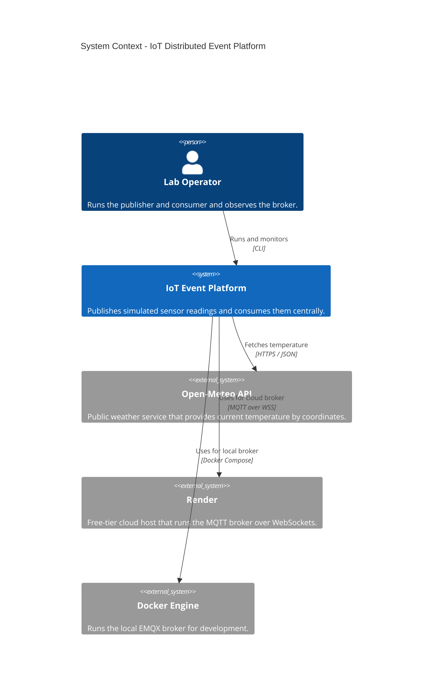
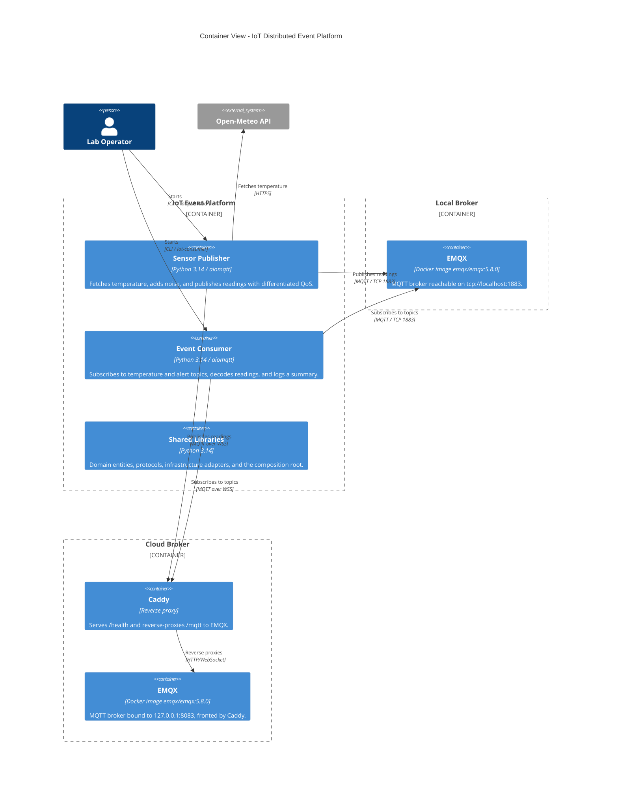
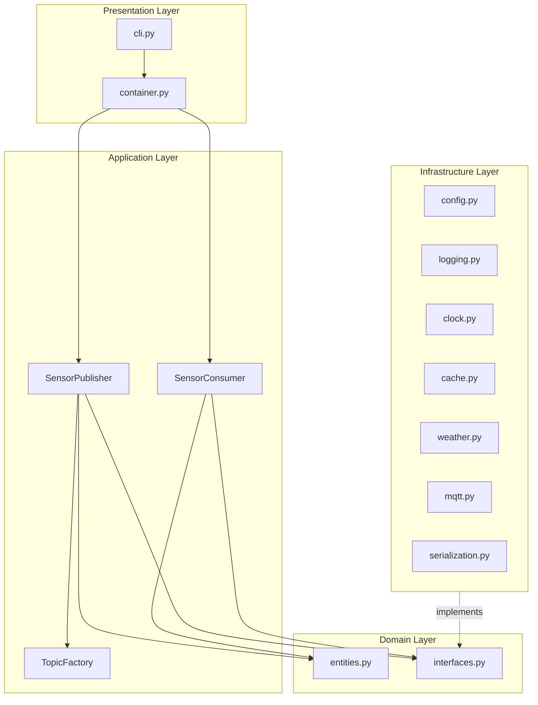

# Architecture

This document describes the IoT Distributed Event Platform using C4-style diagrams (Context and Container levels) and complementary diagrams. All diagrams use Mermaid syntax and render natively on GitHub and GitLab.

## System Context

## Container View

## Layered Structure

## Design Principles

- **Dependency Inversion:** The domain and application layers depend only on `Protocol` definitions; the infrastructure layer provides concrete implementations.
- **Interface Segregation:** Protocols expose the minimum contract required by each consumer (`RandomProtocol` exposes only `uniform`, `MQTTSubscriberProtocol` only `subscribe` and `messages`).
- **Single Responsibility:** Each module addresses one concern (cache, weather, MQTT, serialization, configuration, logging).
- **Composition Root:** `presentation/container.py` is the only place where concrete adapters are instantiated and bound to use cases.
- **Twelve-Factor App:** All configuration is provided via environment variables, validated at startup with `pydantic-settings`.