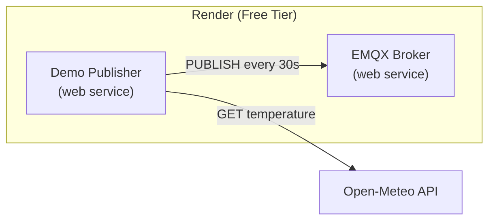

# Demo Publisher

A low-frequency publisher that keeps the cloud MQTT broker reachable and
produces a steady stream of synthetic readings for anyone who subscribes.

## Purpose

Render's free tier puts idle web services to sleep after 15 minutes
without inbound traffic. When the broker sleeps, clients cannot connect.
The demo publisher:

- Publishes one telemetry reading every 30 seconds to the cloud broker.
- Keeps the broker awake through constant inbound MQTT traffic.
- Produces reference data that any subscriber can consume.
- Exposes `/health` so Render can verify the service is running.

## Architecture



## Configuration

The service is declared in `render.yaml` and reads all values from
environment variables. Key defaults:

| Variable | Value | Notes |
|---|---|---|
| `MQTT_BROKER_HOST` | `iot-emqx-broker.onrender.com` | Broker URL |
| `MQTT_BROKER_PORT` | `443` | HTTPS port used by WebSocket transport |
| `MQTT_TRANSPORT` | `websockets` | Required by Render's network policy |
| `MQTT_USE_TLS` | `true` | TLS is terminated by Render's edge |
| `MQTT_WS_PATH` | `/mqtt` | WebSocket path configured in Caddy |
| `DEVICE_PUBLISH_INTERVAL_SECONDS` | `30` | One reading every 30 seconds |
| `DEVICE_DEVICE_ID` | `demo-publisher-001` | Distinct from manual publishers |

## Endpoints

- `GET /health` — returns `200 OK` with body `OK`.

## Subscribing to the demo stream

Any MQTT client can subscribe to the demo publisher's topics:

- `iot/sensors/demo-publisher-001/temperature` (QoS 0)
- `iot/sensors/demo-publisher-001/alert` (QoS 2)
- `iot/sensors/demo-publisher-001/status` (QoS 1, retained)

Example with `mosquitto_sub`:

```bash
mosquitto_sub \
    -h iot-emqx-broker.onrender.com \
    -p 443 \
    --ws-path /mqtt \
    -t 'iot/sensors/demo-publisher-001/#' \
    -v
```

## Local execution

The same publisher runs locally against the Docker broker:

```bash
make up
PORT=8080 uv run iot-demo-publisher
```

Open http://localhost:8080/health to verify the endpoint.