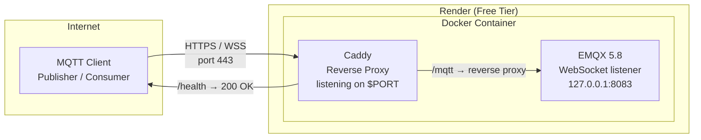
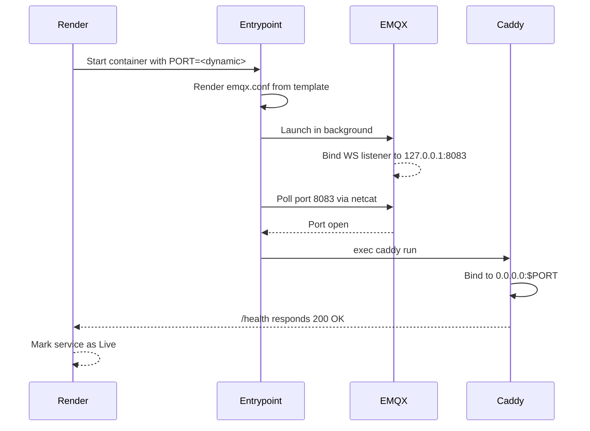

# Deploying the MQTT Broker to Render

This guide explains how to deploy the EMQX MQTT broker to Render using the free plan and WebSocket transport.

## Prerequisites

- A Render account (free tier is sufficient).
- A GitHub or GitLab repository containing this project.
- The repository must be connected to Render.

## Why WebSockets Instead of TCP?

Render's free plan does not expose arbitrary TCP ports. The standard MQTT port 1883 is therefore unreachable from outside Render's network. The only way to expose MQTT is through WebSockets, which Render supports on the HTTP/HTTPS port (443).

This means:

- Caddy listens on the dynamic port assigned by Render via the `PORT` environment variable.
- Caddy serves a `/health` endpoint for Render's health checks and reverse-proxies `/mqtt` to EMQX.
- EMQX binds its WebSocket listener to `127.0.0.1:8083`, only reachable from inside the container.
- Clients connect using `wss://<service-name>.onrender.com/mqtt`.

## Architecture



## Deployment Steps

### 1. Connect the Repository

1. Log in to [Render Dashboard](https://dashboard.render.com).
2. Click **New** > **Blueprint**.
3. Connect your GitHub or GitLab account and select the repository.
4. Render will detect the `render.yaml` file at the root.

### 2. Review the Blueprint

Render will show a preview of the service defined in `render.yaml`:

- **Name**: `iot-emqx-broker`
- **Type**: Web Service
- **Runtime**: Docker
- **Plan**: Free
- **Region**: `oregon` (change if needed)

### 3. Deploy

Click **Apply**. Render will:

1. Build the Docker image from `docker/emqx/Dockerfile.render`.
2. Start the container with the environment variables defined in `render.yaml`.
3. Assign a public HTTPS URL, e.g. `https://iot-emqx-broker.onrender.com`.

### 4. Verify the Deployment

Once the service is live, verify with:

```bash
curl https://iot-emqx-broker.onrender.com/health
# Expected: 200 OK with body "OK"

curl -i https://iot-emqx-broker.onrender.com/mqtt
# Expected: 200 OK (Caddy handles the fallback), or 400 if no WebSocket upgrade
```

- **MQTT WebSocket endpoint**: `wss://iot-emqx-broker.onrender.com/mqtt`
- **Health check**: Render checks `GET /health`, which Caddy responds to with `200 OK`.
- **Port detection**: Caddy binds to the port assigned by Render. EMQX binds internally to `127.0.0.1:8083`.

### 5. Connect a Client

From your local machine, configure the publisher and consumer to use:

```
MQTT_BROKER_HOST=iot-emqx-broker.onrender.com
MQTT_BROKER_PORT=443
MQTT_TRANSPORT=websockets
MQTT_USE_TLS=true
MQTT_WS_PATH=/mqtt
```

These variables are read by the application (see `.env.example`).

## Sequence of Events During Startup



## Free Plan Limitations

- **No persistent disk**: All messages and sessions are lost when the service restarts.
- **Spin-down**: The service sleeps after 15 minutes without inbound traffic. While the publisher is active, the service stays awake. When the publisher stops, the service sleeps and the consumer must reconnect.
- **Cold start**: After sleeping, the first connection takes ~30 seconds to wake the service.

## Troubleshooting

### Service stuck in "In Progress"

1. Check that Caddy's admin API is disabled (`admin off` in `Caddyfile`). If enabled, it binds to port 2019 and Render's port scanner can confuse it with the actual service port.
2. Verify the log line `Using Render-assigned port: <N>`. It must match the port Render assigned.
3. Verify `Listener ws:default on 127.0.0.1:8083 started.` appears before Caddy starts.

### Client cannot connect

- Verify the URL uses `wss://` (not `ws://`).
- Verify the path is `/mqtt`.
- Check that `MQTT_TRANSPORT=websockets` is set in the client.
- Ensure the service is awake (visit the Render dashboard or make an HTTP request).

### gen_rpc errors in the logs

Messages such as `gen_rpc_client_auth_timeout` are internal Erlang RPC warnings emitted by EMQX. They are harmless and do not affect broker operation. They can be safely ignored.

## References

- [Render Blueprint YAML Reference](https://render.com/docs/blueprint-spec)
- [Render Free Plan Limitations](https://render.com/docs/free)
- [EMQX Configuration via Environment Variables](https://www.emqx.io/docs/en/v5.8/configuration/configuration.html)
- [Caddy Documentation](https://caddyserver.com/docs/)