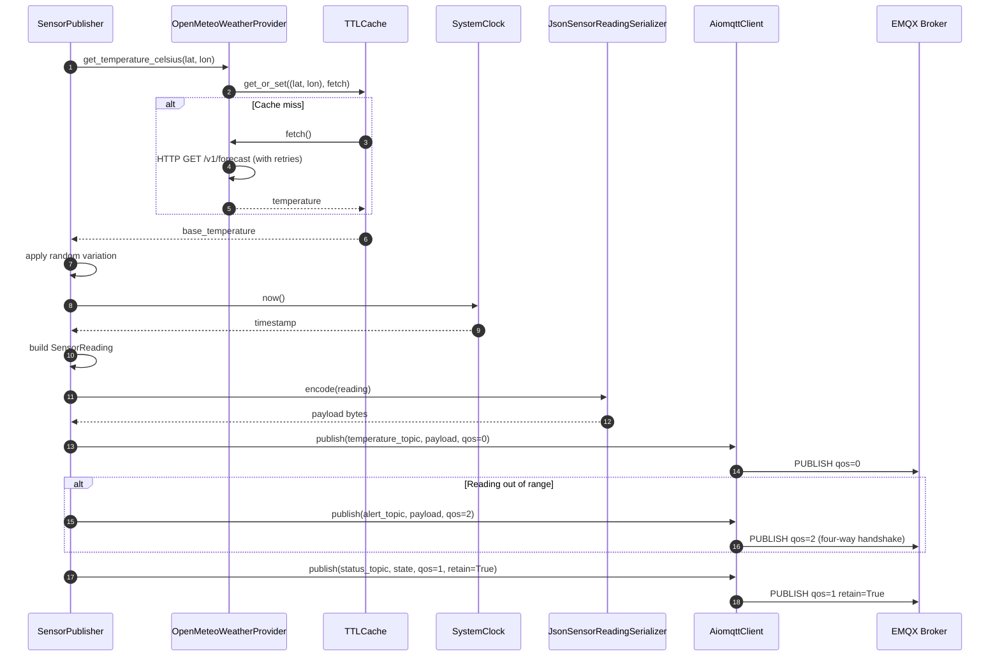
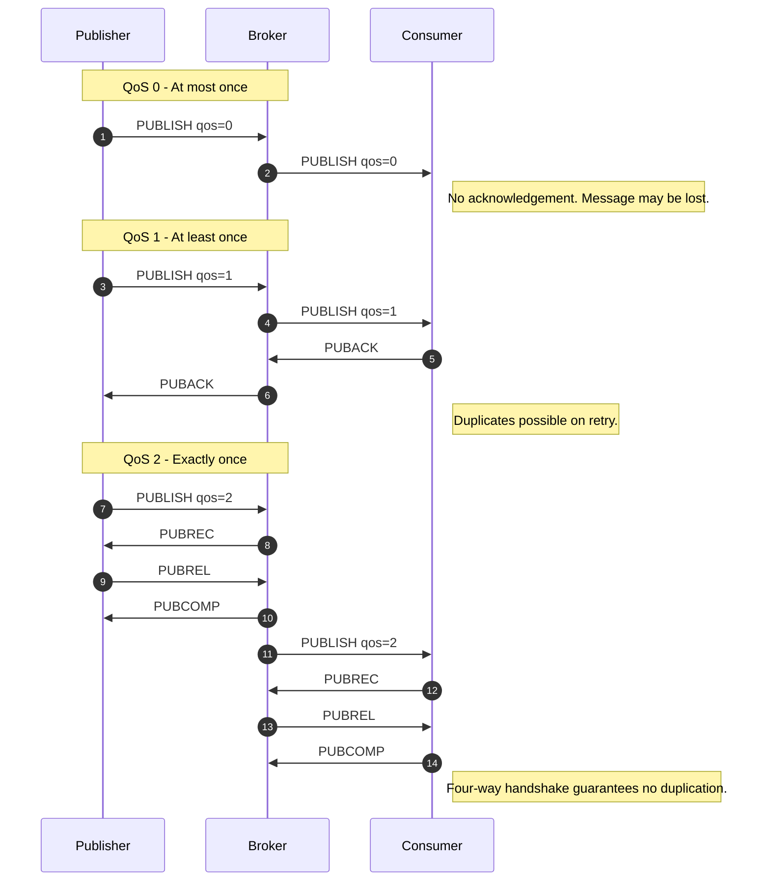
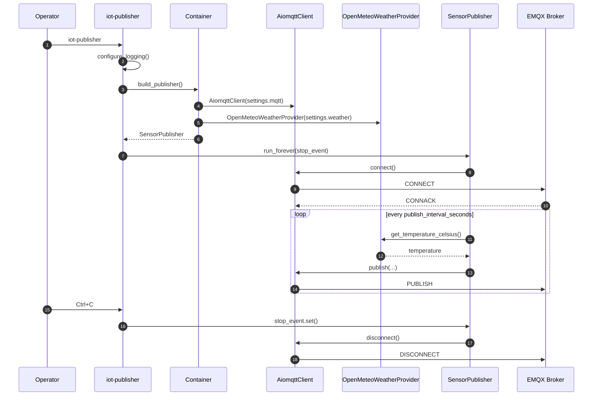

# Sequence Diagrams

All diagrams use Mermaid syntax.

## Publisher Publish Cycle

```mermaid
sequenceDiagram
    autonumber
    participant Pub as SensorPublisher
    participant Weather as OpenMeteoWeatherProvider
    participant Cache as TTLCache
    participant Clock as SystemClock
    participant Ser as JsonSensorReadingSerializer
    participant MQTT as AiomqttClient
    participant Broker as EMQX Broker

    Pub->>Weather: get_temperature_celsius(lat, lon)
    Weather->>Cache: get_or_set((lat, lon), fetch)
    alt Cache miss
        Cache->>Weather: fetch()
        Weather->>Weather: HTTP GET /v1/forecast (with retries)
        Weather-->>Cache: temperature
    end
    Cache-->>Pub: base_temperature
    Pub->>Pub: apply random variation
    Pub->>Clock: now()
    Clock-->>Pub: timestamp
    Pub->>Pub: build SensorReading
    Pub->>Ser: encode(reading)
    Ser-->>Pub: payload bytes
    Pub->>MQTT: publish(temperature_topic, payload, qos=0)
    MQTT->>Broker: PUBLISH qos=0
    alt Reading out of range
        Pub->>MQTT: publish(alert_topic, payload, qos=2)
        MQTT->>Broker: PUBLISH qos=2 (four-way handshake)
    end
    Pub->>MQTT: publish(status_topic, state, qos=1, retain=True)
    MQTT->>Broker: PUBLISH qos=1 retain=True
```

## QoS Negotiation

```mermaid
sequenceDiagram
    autonumber
    participant Pub as Publisher
    participant Broker as Broker
    participant Con as Consumer

    Note over Pub,Broker: QoS 0 - At most once
    Pub->>Broker: PUBLISH qos=0
    Broker->>Con: PUBLISH qos=0
    Note right of Con: No acknowledgement. Message may be lost.

    Note over Pub,Broker: QoS 1 - At least once
    Pub->>Broker: PUBLISH qos=1
    Broker->>Con: PUBLISH qos=1
    Con->>Broker: PUBACK
    Broker->>Pub: PUBACK
    Note right of Con: Duplicates possible on retry.

    Note over Pub,Broker: QoS 2 - Exactly once
    Pub->>Broker: PUBLISH qos=2
    Broker->>Pub: PUBREC
    Pub->>Broker: PUBREL
    Broker->>Pub: PUBCOMP
    Broker->>Con: PUBLISH qos=2
    Con->>Broker: PUBREC
    Broker->>Con: PUBREL
    Con->>Broker: PUBCOMP
    Note right of Con: Four-way handshake guarantees no duplication.
```

## Startup Sequence

```mermaid
sequenceDiagram
    autonumber
    participant Op as Operator
    participant CLI as iot-publisher
    participant Container as Container
    participant MQTT as AiomqttClient
    participant Weather as OpenMeteoWeatherProvider
    participant Pub as SensorPublisher
    participant Broker as EMQX Broker

    Op->>CLI: iot-publisher
    CLI->>CLI: configure_logging()
    CLI->>Container: build_publisher()
    Container->>MQTT: AiomqttClient(settings.mqtt)
    Container->>Weather: OpenMeteoWeatherProvider(settings.weather)
    Container-->>CLI: SensorPublisher
    CLI->>Pub: run_forever(stop_event)
    Pub->>MQTT: connect()
    MQTT->>Broker: CONNECT
    Broker-->>MQTT: CONNACK
    loop every publish_interval_seconds
        Pub->>Weather: get_temperature_celsius()
        Weather-->>Pub: temperature
        Pub->>MQTT: publish(...)
        MQTT->>Broker: PUBLISH
    end
    Op->>CLI: Ctrl+C
    CLI->>Pub: stop_event.set()
    Pub->>MQTT: disconnect()
    MQTT->>Broker: DISCONNECT
```